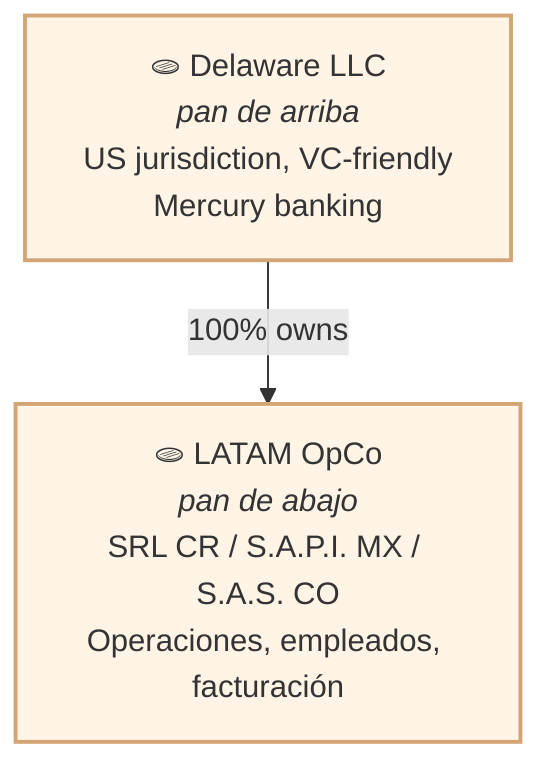
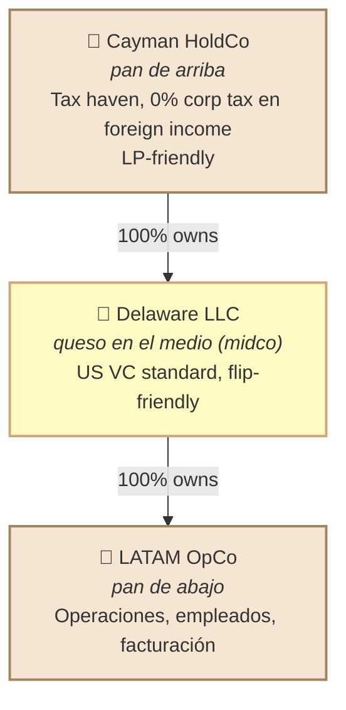

# venture-studio-toolkit

> **Macro portfolio management** para venture studios y serial founders — estructuras legales LATAM, matching de aceleradoras, frameworks govclab, y gestión de portafolio multi-venture.

Plugin de Claude Code complementario a [`business-model-toolkit`](https://github.com/chimeranext/business-model-toolkit) (single-venture) y [`ux-research-toolkit`](https://github.com/chimeranext/ux-research-toolkit) (user research). Mientras esos operan a nivel de **un** venture individual, `venture-studio-toolkit` opera a nivel **portafolio**: decisiones de estructura legal macro, asignación de recursos entre ventures, y matching a programas de aceleración externos.

## ¿Cuándo usar este plugin?

- **Sos fundador con múltiples startups personales** y necesitás decidir: ¿single-LLC para todas o multi-LLC + holding?
- **Operás un venture studio** (tipo Acme Studio) y necesitás estructurar thesis, focus, secret sauce
- **Estás evaluando aceleradoras externas** (YC, Techstars, RevTech Labs, SOSA, Plug and Play, etc.) y querés saber cuál aplica a tu stage/vertical/geografía
- **Estás en LATAM** y necesitás decidir si Skip-CR pattern (US incorp + freelancers LATAM), Delaware Tostada, Cayman Sandwich, o Delaware C-Corp es lo correcto
- **Gestionás portafolio de ventures** y necesitás aplicar Three Horizons (H1/H2/H3), Innovation Scorecard, Cost of Delay, Improvement Kata

## Modos de operación

El plugin funciona en **dos modos** configurables vía `.venture-studio-toolkit.local.md`:

### Studio mode

Para venture studios tipo Acme Studio (startup studios sistemáticos). Incluye:

- `studio-thesis` — govclab 37-word template
- `studio-focus` — Stage × Geography × Industry framework
- `secret-sauce` — 6-metric ranking system
- `studio-archetype-selector` — In-house vs External vs Hybrid
- `vertical-charter` — mission/scope por team (integración Linear)
- `shared-services-ledger` — allocation devs/marketing/legal entre verticals
- `venture-spin-out-playbook` — mecánica de crear LLC separada
- `attached-fund-structure` — Management Co + GP + LP cuando se atache fund
- `mensarius-oath-adoption` — código ético opcional (govclab)

### Founder mode

Para serial entrepreneurs con múltiples ventures personales. Incluye:

- `liability-contagion-analysis` — ventures "high-liability" peligrosas de mezclar bajo single-LLC
- `cap-table-per-venture` — gestión multi-LLC
- `when-to-become-studio` — señales de que tu operación multi-venture debe sistematizarse

### Core skills (ambos modos)

- `structure-decision` — Single-LLC vs Multi-LLC vs Cayman Sandwich vs Delaware Tostada vs Skip-CR
- `structure-evolution-roadmap` — migration paths con triggers (ARR, term sheet, geografía)
- `jurisdiction-matrix` — LATAM + US + Offshore + EU
- `accelerator-launchpad` — matching a programas externos (CIHUBS-style meta-broker)
- `three-horizons` — H1/H2/H3 portfolio allocation
- `explore-exploit` — categorización por venture
- `innovation-scorecard` — customer + business metrics comparativo
- `cost-of-delay-cd3` — priorización económica
- `sweat-equity-agreement` — vesting + cliff + hours×rate + 83(b)
- `improvement-kata` — 5 daily questions

## Jurisdicciones cubiertas nativamente

- **LATAM (8 países)**: CR, MX, CO, CL, PE, UY, AR, BR
- **US incorporation**: Delaware, Wyoming, Texas
- **Offshore holdings**: Cayman, Panamá, BVI
- **EU founder options**: Portugal (Startup Visa + IFICI), Estonia (e-Residency) — referencias + checklist ligero

## Analogía gastronómica de las estructuras LATAM

Los abogados corporativos LATAM (Latitud, Manzano Law, Cooley) adoptaron una **analogía
culinaria** para nombrar las estructuras corporativas — facilita memorización para
founders no-legales:

| Patrón | Analogía | Capas | Visualización |
|---|---|---|---|
| **Delaware Tostada** 🫓 | Tostada (2 tortillas) | 2 | US LLC → LATAM OpCo |
| **Cayman Sandwich** 🥪 | Sandwich (3 panes) | 3 | Cayman HoldCo → DE LLC (midco) → LATAM OpCo |
| **Multi-LLC + Holding** 🥐 | Mil hojas (4+ capas) | 4+ | Holding → Management Co → Fund GP/LP → N Venture LLCs |

### ¿Por qué "Tostada"?

**Delaware Tostada** es una estructura de **2 capas**:



**Ventajas**: pass-through taxation (LLC en Delaware = pass-through), setup barato ($2-3k),
VCs aceptan SAFEs/convertible notes.

**Desventajas**: VCs NO aceptan priced rounds en LLC (necesitan C-Corp o Cayman). Para
Series A+ hay que "graduar" a Cayman Sandwich.

### ¿Por qué "Sandwich"?

**Cayman Sandwich** agrega una capa intermedia (midco) = **3 capas**, como un sandwich:



**Stats**: [47.7% de los unicornios LATAM](https://latitud.com/blog/cayman-sandwich-corporate-structure-startups) usan Cayman Sandwich. Es el standard para Series A+ con VCs internacionales.

**Regla de evolución**: pre-seed/seed = Tostada (flexible + barato). Series A priced round
= graduar a Sandwich (Cayman HoldCo + Delaware midco + LATAM OpCo). Ver [`structure-evolution-roadmap`](./skills/structure-evolution-roadmap/SKILL.md) skill para triggers de migración.

---

## Bilingual output

Templates en español por defecto. Outputs configurables vía frontmatter YAML
(ver [`references/bilingual-output-guide.md`](./references/bilingual-output-guide.md) para
detalle):

```yaml
language:
  templates: es
  outputs: [es, en]
  fallback: es
jurisdiction:
  residence: CR
  incorporation: US-TX
  target_investors: [LATAM, US]
mode: studio  # or founder
```

## MCP integrations (optional)

El plugin puede consumir MCPs externos para enriquecer skills específicos (ver
[`references/mcp-integrations-guide.md`](./references/mcp-integrations-guide.md) para setup):

| MCP | Skills que se benefician | Valor |
|---|---|---|
| **Linear MCP** | `accelerator-launchpad`, `three-horizons`, `innovation-scorecard` | Import ventures desde Linear teams/projects, crear SPIKE issues automáticos |
| **Context7 MCP** | Todos los skills con referencias legales | Docs actualizadas de Stripe, Mercury, Carta |
| **Slack MCP** | `shared-services-ledger`, `innovation-scorecard` | Notificaciones automáticas de monthly allocations o KPI changes (opcional) |

## Fuentes metodológicas

- **Lean Enterprise** (Humble, Molesky, O'Reilly — O'Reilly 2015) — Three Horizons, Innovation Scorecard, Improvement Kata, Cost of Delay
- **Govclab**: [venture studio formation](https://govclab.com/2023/04/25/how-to-build-a-venture-studio/) + [investment thesis](https://govclab.com/2023/11/21/venture-capital-investment-thesis/) + [fund size](https://govclab.com/2021/09/15/how-to-determine-your-venture-capital-fund-size/) + [firm focus](https://govclab.com/2021/09/15/venture-capital-firm-focus/) + [secret sauce](https://govclab.com/2021/09/15/how-to-determine-your-venture-capital-secret-sauce/)
- **LATAM corporate structures**: [Latitud — Cayman Sandwich](https://latitud.com/blog/cayman-sandwich-corporate-structure-startups), [Manzano Law](https://www.manzano.law/post/corporate-structures-for-latin-american-startups), [Carta](https://carta.com/learn/startups/private-companies/incorporation/cayman-sandwich/), [Cooley](https://www.cooleygo.com/the-cayman-sandwich-a-potential-corporate-structure-solution-for-latam-startups/), [ECGI — risks](https://www.ecgi.global/publications/blog/the-cayman-sandwich-risks-for-institutional-and-venture-capital-markets)
- **Accelerators**: CIHUBS, RevTech Labs, Plug and Play, Portal Innovations, SOSA, Y Combinator, 500 Startups, Techstars, MassChallenge, Seedstars, Startup Chile, NUMA, Parallel 18
- **Sweat equity**: [Cake Equity](https://www.cakeequity.com/guides/sweat-equity), [Orchestra](https://www.orchestra.io/blog/what-is-sweat-equity-and-how-can-it-benefit-startups-and-employees)
- **Portugal Startup Visa**: [Touchdown](https://www.touchdown.us/blog/portugal-startup-visa), [Portugal Startup News](https://portugalstartupnews.com/2026/03/18/the-founders-guide-to-portugal-visas-tax-incentives-and-a-maturing-startup-ecosystem/)

## Estado actual

**v1.2.0 — Services Hub pattern + docs overhaul**

Historial de releases (ver [CHANGELOG.md](./CHANGELOG.md) para detalles):

- **v1.0.0** (2026-04-14) — initial feature-complete scope (21 skills + 2 reference docs per SPIKE [legacy-ticket](https://linear.app/chimera-coding/issue/legacy-ticket))
- **v1.1.0** (2026-04-14) — Services Hub pattern (patrón #6) + 3-mode studio readiness (Epic [legacy-ticket](https://linear.app/chimera-coding/issue/legacy-ticket))
- **v1.2.0** (2026-04-15) — gastronomic analogy + Mermaid diagrams + bilingual/MCP reference guides

**Total actual**: **22 skills + 4 reference docs + scaffolding**.

⚠️ **Disclaimer de stability**: v1.x marca **feature-completeness** (scope cumplido per SPIKE), NO **maturity**. El plugin está en fase de **dog-food** y aún no battle-tested con usuarios externos. Durante la serie v1.x:

- **Semver deviation intencional**: puede haber breaking changes en releases menores (v1.1, v1.2, etc.) mientras iteramos sobre feedback de dog-food real. Esto viola semver tradicional deliberadamente — es un trade-off consciente para permitir rápida iteración en esta fase inicial.
- **Strict semver compliance arranca en v2.0.0** una vez validado con ≥3 usuarios externos completando flows end-to-end. Desde v2.0 en adelante, breaking changes requieren major version bump.
- **Cambios esperados en v1.x**: skill APIs, output formats, template structures pueden cambiar basado en findings del dog-food.
- **Implementation status v1.2**: bilingual y MCP integration están documentados como frameworks pero **implementation per-skill es v1.3+ roadmap**.

Si necesitás stability garantizada, esperar a v2.0.0. Para exploración activa + feedback loop, v1.x es apropiado.

### Skills completos (22)

**Core (10)** — ambos modos:
- `structure-decision` | `structure-evolution-roadmap` | `jurisdiction-matrix` (reference doc) | `accelerator-launchpad` | `three-horizons` | `explore-exploit` | `innovation-scorecard` | `cost-of-delay-cd3` | `sweat-equity-agreement` | `improvement-kata`

**Studio mode (9)**:
- `studio-thesis` | `studio-focus` | `secret-sauce` | `studio-archetype-selector` | `vertical-charter` | `shared-services-ledger` | `venture-spin-out-playbook` | `attached-fund-structure` | `mensarius-oath-adoption`

**Founder mode (3)**:
- `liability-contagion-analysis` | `cap-table-per-venture` | `when-to-become-studio`

**Services Hub mode (1, nuevo en v1.1)**:
- `services-hub-setup` — patrón #6 implementation con MSA templates

### Reference docs (4)

- `jurisdiction-matrix.md` — 16 jurisdicciones (LATAM 8 + US 3 + Offshore 3 + EU 2)
- `bilingual-output-guide.md` (nuevo en v1.2) — YAML config schema + translation rules
- `mcp-integrations-guide.md` (nuevo en v1.2) — MCPs que enhance qué skills

### ⚠️ Disclaimers legales

Skills que tocan dominios legales/fiscales incluyen explicit disclaimers:
- `structure-decision`, `structure-evolution-roadmap`, `jurisdiction-matrix`
- `sweat-equity-agreement`, `cap-table-per-venture`
- `attached-fund-structure`, `venture-spin-out-playbook`
- `shared-services-ledger`, `liability-contagion-analysis`

Estos skills generan material de preparación estructurada — **NO son asesoría legal**. Validar con abogados especializados antes de actuar.

## Instalación

Cuando el plugin esté publicado:

```bash
claude plugin add chimeranext/venture-studio-toolkit
```

## Plugins complementarios del ecosistema

- [`business-model-toolkit`](https://github.com/chimeranext/business-model-toolkit) — single venture lifecycle (21 fases)
- [`ux-research-toolkit`](https://github.com/chimeranext/ux-research-toolkit) — user research maps
- `launchpad-toolkit` (en desarrollo — [legacy-ticket](https://linear.app/chimera-coding/issue/legacy-ticket)) — prototipo metodológico del chimeranext Launchpad

## Licencia

Business Source License 1.1 (BSL-1.1). Ver [LICENSE](./LICENSE) para detalles.
