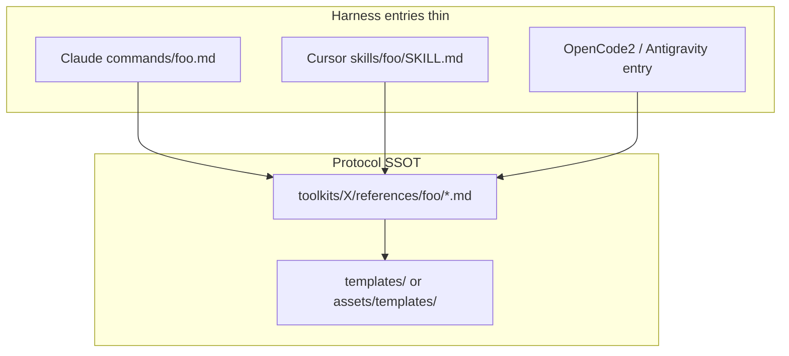
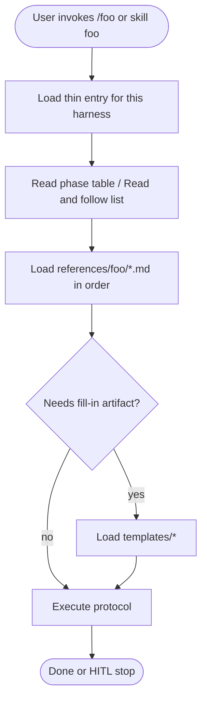
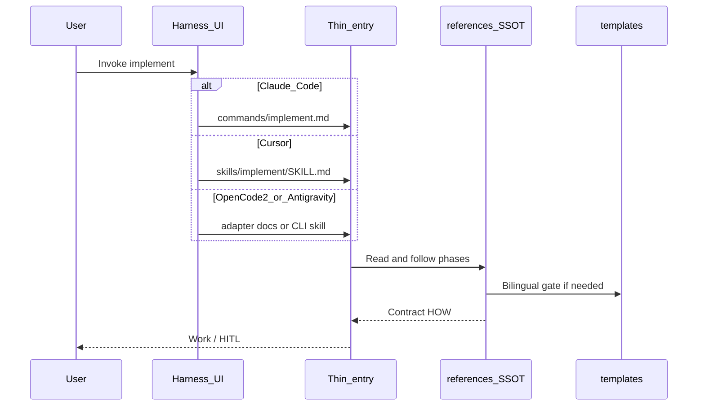
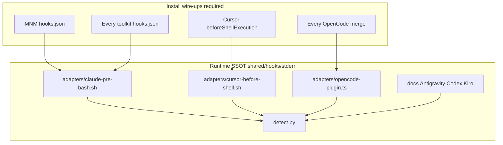
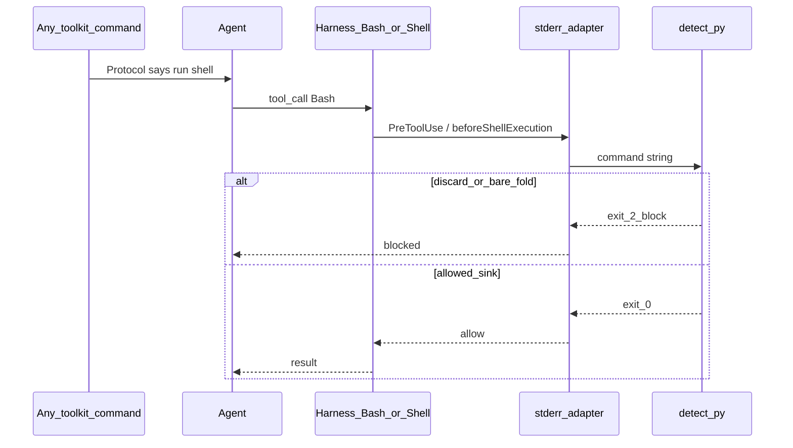
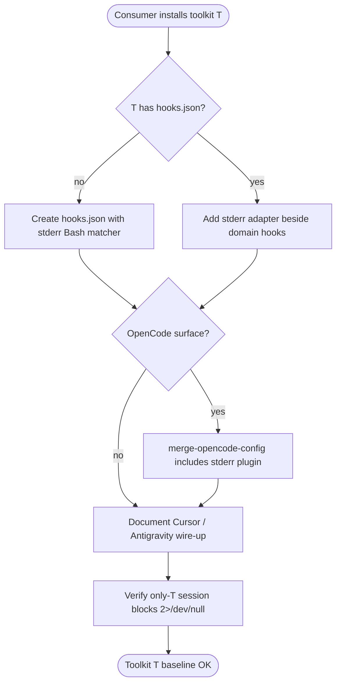
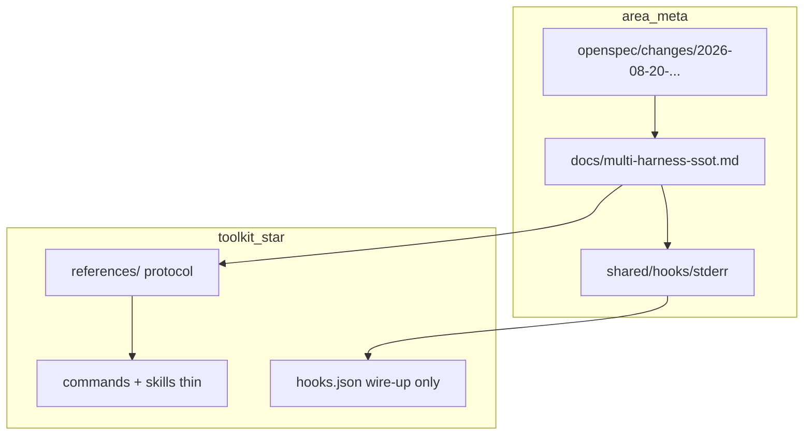

# Proposal — Multi-harness SSOT + stderr baseline

**Change:** `2026-08-20-multi-harness-ssot`
**Domain:** `area:meta`
**Status:** Proposed
**Date:** 2026-08-20

## What we will build

Two orthogonal SSOTs for the entire `better-toolkits` monorepo:

1. **Protocol SSOT** — markdown under `toolkits/<name>/references/` (+ `templates/`),
   consumed by thin harness entries (Claude `commands/`, Cursor `skills/`,
   OpenCode2 / Antigravity adapters). Same contract for every toolkit command.
2. **Runtime SSOT (stderr)** — one `detect.py` + adapters under `shared/hooks/stderr/`,
   wired into **every** toolkit install path so any Bash/shell from any command
   is guarded without per-command edits.

Plus: OpenCode install/merge on toolkits that lack it today, always registering stderr.

## For whom

- Maintainers shipping toolkits to Claude Code, Cursor, OpenCode2, Antigravity, Codex, etc.
- Consumers who install **one** toolkit and must still get stderr (no silent hole).
- Agents running `/implement`, `/ship-*`, `/write-*`, skills — same protocol shape.

## Why now

- `/implement` is a 499-line monolito; Bilingual Format is triplicated.
- Stderr exists only where MNM (or manual Cursor/OpenCode wiring) is installed —
  install-only-IDT / aaarrr leaves Bash unprotected.
- Cursor `/` surfaces skills, not Claude `commands/` — without a multi-entry model,
  “protocol” looks like a Cursor-vs-Claude dichotomy (it is not).
- Repo governance (`openspec/project.md`) requires durable HOW before XL refactors.

## Success criteria

- [ ] Active OpenSpec change exists; first implementation commit is `docs(openspec): …`.
- [ ] Session with **only** aaarrr (or only IDT) installed → `2>/dev/null` Bash blocked.
- [ ] `/implement` (and Cursor skill `implement`) are thin orchestrators over `references/implement/*`.
- [ ] `templates/bilingual-issue-brief.md` is the fill-in SSOT; spike/spec no longer embed full template.
- [ ] Contract doc `docs/multi-harness-ssot.md` describes both SSOTs + harness matrix.
- [ ] Fat cmds (>150 lines) migrate by olas without behavior change (HITL / OpenSpec Phase 0 / 15-file rule intact for implement).

## Out of scope

- Renaming packages or plugin slugs.
- Cloning `detect.py` into each toolkit (wire-up only; single SSOT).
- Making prod-write / observability **mandatory** without consumer JSON (same wire-up model, later priority).
- Rewriting all fat commands in a single PR.

---

## UML — Protocol SSOT (component, vertical)

Which markdown is authoritative for a command protocol:

## UML — Protocol load activity (vertical)

Agent resolves and loads SSOT (no harness-specific body in references):

## UML — Multi-harness entry sequence (vertical)

Same SSOT, three harnesses:

## UML — Runtime stderr SSOT (component, vertical)

One detector; N wire-ups; applies to ALL commands once session has hook:

## UML — Stderr on any command (sequence, vertical)

Why we do not edit each `commands/*.md`:

## UML — Install-path activity “sin excepción” (vertical)

## UML — Dual-SSOT ownership (package, vertical)

