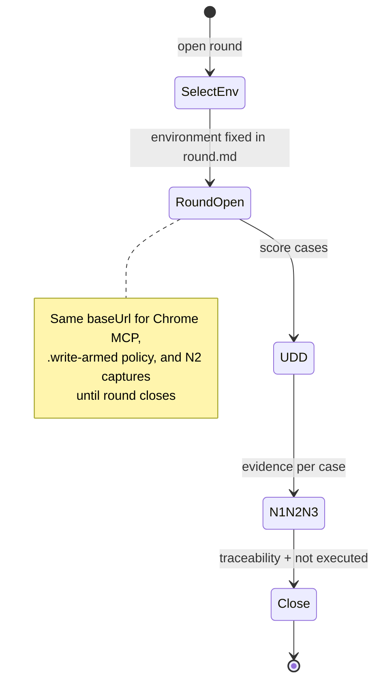

# Generalize `/bug-squash` — Design

**Status:** Proposed

## Decision: one round, one environment

A **round** is the atomic HITL unit. It MUST NOT change deployment environment after open.



| Valid | Invalid |
| --- | --- |
| round-001 @ `localhost` → close @ `localhost` | round-001 starts `localhost`, continues on `devel` |
| round-002 @ `staging` after round-001 PASS | one `round.md` with `Current hop: localhost → staging` |
| waiver skips **staging round** entirely | waiver to “skip hop” inside active round |

**Coverage across environments:** the operator (or release checklist) schedules **separate rounds**, each with its own directory and `environment` field.

## Config shape (`bug-squash.config.json`)

Scaffolded on first invocation when missing (interactive or template copy + edit).

```json
{
  "roundDir": "docs/qa/rounds",
  "environments": {
    "localhost": {
      "enabled": true,
      "baseUrl": "http://localhost:8080",
      "writesAllowed": true
    },
    "devel": {
      "enabled": true,
      "baseUrl": "https://devel.example.com",
      "writesAllowed": false
    },
    "staging": {
      "enabled": true,
      "baseUrl": "https://staging.example.com",
      "writesAllowed": false
    },
    "prod": {
      "enabled": false,
      "baseUrl": "https://app.example.com",
      "writesAllowed": false
    }
  },
  "waiverRegister": "docs/qa/waivers.md",
  "overlayCommand": null
}
```

Rules:

- **`prod.enabled` defaults to `false`.** Enabling prod requires explicit config edit + documented waiver/approval policy in overlay.
- **`enabled: false`** on any environment excludes it from the picker; skipping without running uses **waiver ID** in plan/Linear, not inside `round.md` hop fields.
- **`baseUrl`** is the sole origin for Chrome MCP navigation for that round.
- Overlays (Seacrets) add: Slack channel, Linear team, Pest filter prefix, auth hop URLs — not duplicated in base toolkit.

## Bootstrap flow (first run)

1. Resolve repo root (cwd with `.git` or configured root in `make-no-mistakes.config.json`).
2. If `bug-squash.config.json` missing → run `references/bug-squash/setup-init.md`:
   - Copy `bug-squash.config.example.json` → `bug-squash.config.json`
   - Prompt for `baseUrl` per default-enabled environment
   - Create `roundDir` if absent
   - Do **not** proceed to Chrome MCP until config validates (JSON schema + at least one enabled environment)
3. If config exists but invalid → fix interactively; do not invent URLs.

## Round open gate (before Chrome MCP and `.write-armed`)

The command MUST:

1. Load config.
2. **Select environment** — explicit `$ARGUMENTS`, AskQuestion, or resume from existing open `round.md` `environment` field.
3. Write or update `round.md` header with **`environment`** (single enum) and **`baseUrl`** (resolved from config).
4. Only then: Chrome DevTools MCP (headed), test runs, or arming writes per environment policy.

For `writesAllowed: false` environments, `.write-armed` remains human-created only (hook-enforced on prod; overlay may extend to devel/staging).

## `round.md` schema (SSOT — replaces hop chain header)

Required header fields:

```markdown
# <Domain> bug-squash round — YYYY-MM-DD

- **Environment:** localhost | devel | staging | prod
- **Base URL:** <resolved baseUrl — must match config for Environment>
- **Round ID:** <domain>-YYYY-MM-DD[-NNN]
- **Ref:** `<git ref @ sha>`
- **Operator:** @handle
- **Status:** open | closed
- **HITL coverage:** <N3 count> / <cases routed>
- **Coordination:** <Slack thread or overlay-specific — optional in base>
```

**MUST NOT appear in v2 schema:**

- `Hops: localhost → devel → …` as a progression inside one round
- `Current hop:` that changes during the same round file

**Per-case table:** N1/N2/N3 columns are **for this environment only** (not “per hop that ran”).

Closing sections unchanged in intent: Traceability, Currency, Gap analysis, Accountability, **Not executed, and why** (non-placeholder).

## Layering (base + overlay)

| Layer | Repo | Artifact |
| --- | --- | --- |
| Protocol | `make-no-mistakes-toolkit` | `commands/bug-squash.md`, `references/bug-squash/*` |
| Config | Consumer repo root | `bug-squash.config.json` |
| Profile | Consumer repo | `.cursor/commands/bug-squash-<startup>.md` (Seacrets: `bug-squash-seacrets.md`) |
| Runbooks | Consumer docs | localhost boot, auth, domain SOP (Seacrets docs stay in `seacrets.online-docs`) |

Seacrets migration:

- Deprecate `bug-squash.md` → 5-line pointer to toolkit + `/bug-squash-seacrets`
- OpenSpec v1 in `seacrets.online-specs` (SCRT-525) remains historical; link to this change ID for v2

## Hook compatibility

`hooks/qa/pre-tool-prod-write-guard.sh` already blocks prod browser mutations without `.write-armed`. Round protocol MUST set `$MNM_QA_ORIGIN` or equivalent from **`round.md` `Base URL`** so guard matches the single-environment round.

## Rejected

- Four-hop mandatory chain inside one round (v1 Seacrets mistake for generic toolkit)
- Fail closed on missing config without bootstrap
- Default `prod.enabled: true`
