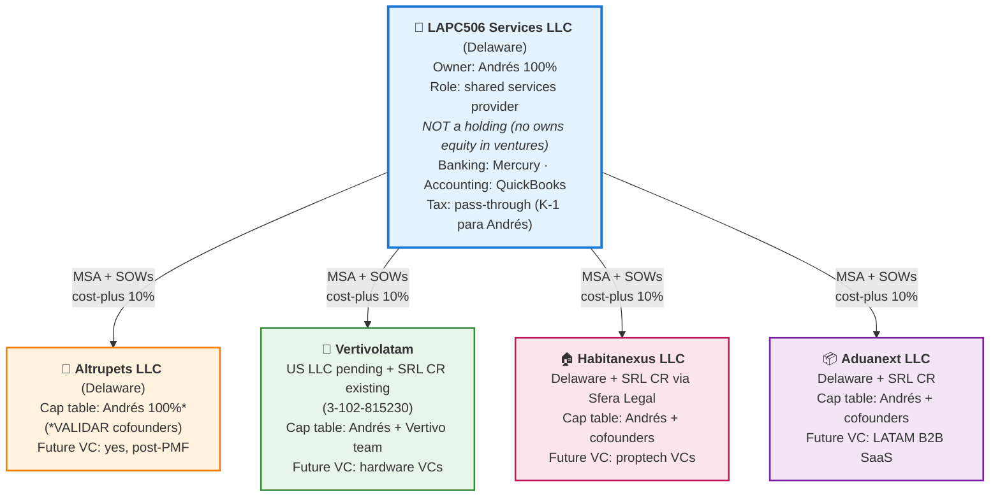

# Canonical Case: @lapc506 Services Hub Model

> **Propósito**: ejemplo concreto del skill `services-hub-setup` (`structure-decision`
> patrón #6) aplicado al caso real de @lapc506 (Andrés Peña, serial entrepreneur
> Costa Rica). Sirve como:
>
> 1. **Reference** para usuarios con perfil similar (serial entrepreneur LATAM con
>    3-5 ventures simultáneas)
> 2. **Test case** — valida que el Services Hub pattern produce outputs accionables
> 3. **Anti-abstract** — evita tono académico; caso real con numbers y jurisdicciones
>    específicas
>
> **Fuente del dog-food**: `~/Escritorio/lapc506-personal-dogfood/` (generado
> 2026-04-14).
>
> **Nota de privacy**: data personal concrete (montos, legal names finales) se omite
> o marca `[VALIDAR]`. El founder (Andrés) puede publicar caso completo cuando quiera.

---

## Context del founder

- **Nombre**: Andrés Peña Castillo (@lapc506)
- **Residencia**: San José, Costa Rica
- **Tax residency**: CR
- **Role principal**: Product Owner de Pathways + Agent (Doji) en chimeranext Labs
- **Rol secundario**: Serial entrepreneur con 4 startups personales en diferentes
  stages

## Portfolio de ventures personales

| Venture | Sector | Stage | Legal actual | Liability | MRR estimado |
|---|---|---|---|---|---|
| **Altrupets** | Animal welfare (denuncias sanitarias) | Pre-revenue, MVP building | No incorporado | 🔴 High | $0 |
| **Vertivolatam** | Hardware + SaaS vertical farming | Prototype stage | SRL Costa Rica (3-102-815230) + US LLC pending | 🟡 Medium | $0 |
| **Habitanexus** | Proptech — alquiler con escrow | BMT complete, pre-launch | No incorporado (plan SRL con Sfera Legal) | 🔴 High | $0 |
| **Aduanext** | B2B SaaS — customs compliance | BMT complete, pre-beta | No incorporado | 🟡 Medium | $0 |

## Studio stake (separate scope)

- **chimeranext Labs** — venture studio donde Andrés es PO de 2 pillares. Separate
  legal entity (Texas LLC). NO parte del Services Hub personal — Andrés es PO, no
  founder.

---

## ¿Por qué Services Hub y no otra estructura?

### ¿Por qué NO Single-LLC multi-brand?

Liability contagion analysis (ver dog-food output `liability-contagion-analysis.md`):

- Altrupets (🔴) + Habitanexus (🔴) = NEVER combinables (high-liability both)
- Altrupets (🔴) + Vertivolatam (🟡) = ❌ (contamination cross-liability)
- Habitanexus (🔴) + Aduanext (🟡) = ❌

**Conclusión**: el mix 2×🔴 + 2×🟡 no permite ninguna combination bajo single-LLC.

### ¿Por qué NO Multi-LLC + Holding (patrón #7)?

- No hay plan de LP fund atado
- Ninguna venture en Series A todavía
- Holding overhead ($15-25k setup + $5-10k annual) no justificado sin fund
- Complejidad fiscal multi-entity innecesaria a este stage

### ¿Por qué NO Multi-LLC sin shared services?

- @lapc506 opera como **shared resource** — mismos skills (dev, product,
  methodology) sirven las 4 ventures
- Tools compartidos (Claude Code, GitHub, Notion, Linear, BMT toolkit)
- Legal retainer único (Sfera Legal) sirve las 4 ventures CR-side
- **Sin Services LLC central**: transfer pricing no compliance, personal income
  distributed across 4 K-1s, chaos

### ¿Por qué Services Hub? ✅

- Multi-LLC para liability protection (4 Venture LLCs)
- + Services LLC central para shared efficiency
- VC raises independent per venture (cap tables limpios)
- Personal income consolidado via Services LLC
- Transfer pricing defensible (MSAs bilaterales + cost-plus 10%)
- Path a Holding claro cuando 2+ ventures hit Series A

---

## Architecture propuesta



---

## Setup breakdown (concrete numbers)

### 1. LAPC506 Services LLC (Delaware)

- **Setup**: Stripe Atlas $500 + bank setup via Mercury (free) = $500
- **Annual**: $300 Delaware franchise + $100 registered agent = $400/year
- **Naming**: "LAPC506 Services LLC" (o alt: "Lapc506 Ventures Services LLC")
- **Initial capital contribution**: $1k (minimum)

### 2. Altrupets LLC (Delaware — Skip-CR initially)

- **Setup**: Stripe Atlas $500 = $500
- **Annual**: $400/year (franchise + agent)
- **Post-PMF / pre-user launch**: add CR SRL si requiere compliance local

### 3. Vertivolatam (existing SRL CR + US LLC pending)

- **Already has**: SRL CR 3-102-815230 (~$800 annual)
- **Pending**: US LLC via Stripe Atlas or similar = $500 setup + $400 annual
- **Total Vertivolatam annual ongoing**: $1,200

### 4. Habitanexus LLC (Delaware) + SRL CR via Sfera Legal

- **Urgent**: Delaware LLC Stripe Atlas $500
- **CR-side**: SRL CR via Sfera Legal $1,500-$2,000 (requires CR entity por escrow
  operations compliance)
- **Total Habitanexus setup**: $2,000-$2,500
- **Annual**: $1,200

### 5. Aduanext LLC (Delaware) + SRL CR

- **Delaware LLC**: $500 setup + $400/year
- **SRL CR**: $1,500 setup (Sfera Legal can handle batch) + $800/year
- **Total Aduanext annual**: $1,200

### Total investment

| Item | Setup | Annual |
|---|---|---|
| LAPC506 Services LLC | $500 | $400 |
| Altrupets LLC | $500 | $400 |
| Vertivolatam (completing pending US LLC) | $500 | $1,200 |
| Habitanexus (DE + CR SRL Sfera) | $2,500 | $1,200 |
| Aduanext (DE + CR SRL) | $2,000 | $1,200 |
| **Total** | **$6,000** | **$4,400** |

**Plus**:
- MSA legal review (Sfera Legal o similar): $1,000-$2,000 one-time
- Accounting setup (QuickBooks): $30-50/month × 5 entities = $150-250/month
- Insurance (recomendado per venture): $5-8k/year combined

---

## MSA structure (template applied)

**Services LLC → Venture LLC** (4 MSAs idénticos en structure, diferentes fees per scope):

- **Parties**: LAPC506 Services LLC + [Venture Name] LLC
- **Services scope**: Engineering, Product, Design, Marketing, Legal coordination,
  Finance/Accounting oversight
- **Pricing methodology**: Cost-plus 10% markup
  - Cost = Andrés fully-loaded hourly cost ($X/hr) × hours worked per venture
  - Markup = 10% (defensible per OECD guidelines para technical services)
- **Billing cadence**: Monthly, invoice on day 3, due NET 15
- **IP assignment**: Work product → Venture LLC. LAPC506 Services keeps reusable
  frameworks + methodologies + BMT toolkit usage (but these are open source so N/A)
- **Liability cap**: 12 months of fees per venture
- **Termination**: 60-day notice + transition plan
- **Governing law**: Delaware (matching Services LLC jurisdiction)

---

## Transfer pricing documentation

Arm's-length defense documentation:

- **Methodology**: Cost-plus 10%
- **Benchmark source**: OECD Transfer Pricing Guidelines Ch. 6 (services) +
  Deloitte/PwC 2024 transfer pricing benchmarks: 5-12% markup typical para
  intercompany technical services, 10% es median
- **Cost calculation**:
  - Andrés salary from Services LLC: $[VALIDAR — depends on personal finances]/month
  - Benefits + payroll taxes: ~30% overhead
  - Fully loaded hourly rate: $[VALIDAR]/hour
- **Time tracking**: Harvest (or similar) split per venture weekly
- **Documentation refresh**: Annual review + update benchmarks

---

## Time allocation proposal

Based on current effort split (estimated Q2 2026):

| Venture | Time % (est) | Hours/week (if 40 hr total) |
|---|---|---|
| Habitanexus | 30% | 12 hr |
| Aduanext | 20% | 8 hr |
| Vertivolatam | 20% | 8 hr |
| Altrupets | 15% | 6 hr |
| LAPC506 Services admin | 10% | 4 hr |
| Buffer / internal | 5% | 2 hr |

**Flag**: 40 hr/week de Andrés para startups personales + chimeranext PO work =
sobrecarga obvia. Realistic revision needed — ¿realmente dedica 40hrs/week a las 4
ventures o es aspiracional?

**Recomendación**: usar `cost-of-delay-cd3` skill para priorizar cuál venture
merece más time investment.

---

## Evolution triggers (cuándo upgrade a Holding)

**NO hacer Holding ahora**. Triggers para future upgrade:

- ✅ **2+ ventures hit Series A** ($2M+ priced rounds)
- ✅ **Plan de levantar fund atado** (>=$3MM de LPs)
- ✅ **Tax optimization justifies complexity** (CPA calcula $50k+/year savings por
  consolidation)
- ✅ **Exit strategy del studio como entity** (vs. exits individuales)

**Timing realistic**: probablemente 18-36 meses para el upgrade, si alguna venture
lo amerita.

**Estructura destino** (pattern #7):

```
Lapc506 Holdings Inc (Delaware C-Corp o Cayman)
├── Management Company (renamed from LAPC506 Services LLC)
├── GP Entity (new)
├── Fund LP (new, if fund raised)
└── Venture LLCs (owned by Holding)
```

---

## Legal counsel recommended

Por jurisdicción:

- **Delaware (5 LLCs)**: Stripe Atlas legal (for basic formation), Cooley o similar
  for complex matters
- **Costa Rica (Vertivolatam SRL + Habitanexus SRL + Aduanext SRL)**: Sfera Legal
  (already engaged for Habitanexus plan per `business-model` docs)
- **Tax (US + CR multi-jurisdictional)**: CPA con experience LATAM → US structures
  (recommendations: Bright!Tax, Gaston & Gomez CR, o similar)
- **IP (Vertivolatam patents pending)**: IP lawyer especializado — Bert Gómez Paulson
  (CR) o international
- **Transfer pricing review (annual)**: Deloitte / PwC LATAM Services practices

Total advisor spend estimate: $5-10k/year total across these (discrete projects mostly).

---

## Red flags + urgencies

### Urgency 1: Habitanexus escrow exposure

Si Habitanexus ya está operating en beta con depósitos en custodia SIN entity
formal: **stop immediate**. Transfer escrow to abogado licenciado O pausar
operations hasta incorporation done. Personal unlimited liability on escrow disputes
es existential risk.

### Urgency 2: Altrupets sensitive data

Antes de lanzar beta público con denuncias de abuso animal → Delaware LLC + privacy
policy + TOS + compliance framework. Sin esto, primera demanda apunta directo al
founder personalmente.

### Moderate priority: Vertivolatam US LLC completion

Si `06-ip-strategy.md` depende de US LLC filing para patents → complete ASAP antes
de que third parties file similar patents.

---

## Referenced skills

- **`structure-decision`** patrón #6 (Services Hub): estructura macro decidida
- **`services-hub-setup`**: implementation concreta de MSAs + transfer pricing
- **`liability-contagion-analysis`**: rationale del Multi-LLC requirement
- **`when-to-become-studio`** v1.1: este caso es Modo 2 (Services Hub operator)
- **`structure-evolution-roadmap`**: triggers para upgrade a Holding
- **`cap-table-per-venture`**: per-venture cap table management post-incorporation

## Dog-food outputs de origen

Todo este canonical está basado en outputs reales generados 2026-04-14 en
`~/Escritorio/lapc506-personal-dogfood/`:

- `README.md` — overview del dog-food
- `structure-decision.md` — recomendación inicial (v1.0 pattern — pre Services Hub)
- `liability-contagion-analysis.md` — análisis crítico
- `when-to-become-studio.md` — readiness assessment (7/9 signals)

Este canonical es la **v1.1 refinement** — añade Services Hub como el pattern
correcto (vs. generic "Multi-LLC" de v1.0).
