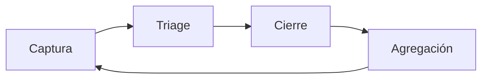

# NPS y Feedback Loop — el sensor del flywheel

Referencia canónica de NPS (Net Promoter Score) y del ciclo de feedback para la etapa **Retention**.
La consume el comando `/retain` y el agente `retention-automator`. El NPS mide la salud del flywheel
*antes* de que el churn la confirme: un NPS que cae es un leading indicator; un churn que sube es el
lagging indicator del mismo problema.

Doctrina del toolkit: **un promoter es la semilla de un referral que compra a $0**. El NPS no es una
vanity metric si se cierra el loop — si solo se mide y no se actúa, sí lo es.

---

## 1. NPS — fórmula y segmentación

La pregunta única (Ultimate Question): *"¿Qué tan probable es que recomiendes {producto} a un colega
o amigo?"* en escala 0–10. Las respuestas se segmentan en tres grupos:

| Segmento | Score | Qué significan | Acción |
|---|---|---|---|
| **Promoters** | 9–10 | Leales, evangelizan, bajo churn | Seed de referral (`/refer`) + fuente de LAL |
| **Passives** | 7–8 | Satisfechos pero no atados; churneables | Empujar a promoter con quick wins |
| **Detractors** | 0–6 | Insatisfechos, churn alto, boca-a-boca negativo | Triage urgente (ver feedback loop) |

**Fórmula**:
```
NPS = % Promoters − % Detractors
```
(Los passives NO entran en el cálculo, pero sí cuentan en el denominador de los porcentajes.)

El rango es −100 a +100. Interpretación de referencia:

| NPS | Lectura |
|---|---|
| 🔴 < 0 | Más detractores que promoters — problema de producto, no de media |
| 🟡 0–30 | Aceptable, hay tracción pero fuga de valor |
| 🟢 30–50 | Bueno — base sana de promoters para alimentar referral |
| 🟢 > 50 | Excelente — el flywheel de referral debería estar encendido |

**Trampa**: comparar tu NPS absoluto contra benchmarks de otra industria. El NPS es más útil como
**tendencia propia** (¿sube o baja MoM?) y **segmentado por cohorte** que como número absoluto.

---

## 2. Cadencia de medición

- **Relacional** (trimestral): a toda la base activa, mide la salud general de la relación. Es el NPS
  que se reporta al board.
- **Transaccional** (event-triggered): tras un momento clave (onboarding completo, primer resultado,
  interacción con soporte). Mide la experiencia puntual, no la relación.
- **Segmentación obligatoria**: reportar NPS por cohorte de antigüedad y por plan/segmento. Un NPS
  blended de 40 puede esconder detractors concentrados en la cohorte que más paga.

**Regla de muestreo**: no encuestar al mismo usuario más de una vez por trimestre (survey fatigue).
Apuntar a ≥ 100 respuestas antes de leer el número como señal, no ruido.

---

## 3. Feedback Loop — captura → triage → cierre

El NPS sin loop cerrado es teatro. Cada respuesta, sobre todo la de un detractor, dispara un ciclo:



### Captura
- Recolectar el score **y el comentario abierto** ("¿cuál es la razón principal de tu score?"). El
  comentario es donde vive la señal accionable; el número solo prioriza.
- Etiquetar cada respuesta: segmento (promoter/passive/detractor), cohorte, tema del comentario.

### Triage
- **Detractors → SLA de 48h**: contacto humano directo. Objetivo doble: rescatar la cuenta (evitar el
  churn que el score predice) y extraer la causa raíz.
- **Passives → campaña**: agruparlos en la audiencia de retención; atacar el gap más citado con un
  quick win.
- **Promoters → referral**: enrutarlos a `/refer` como seed de la audiencia `buyers_high_ltv`;
  pedir referral o review *en el momento* del score alto (peak-end rule).

### Cierre
- **Close the loop con el usuario**: volver a quien dio feedback y decirle qué se hizo con él. Un
  detractor cuyo problema se resuelve y a quien se le avisa suele convertirse en promoter — el
  "service recovery paradox".
- **Cierre interno**: el tema pasa al backlog con su frecuencia (cuántos detractors lo citaron).

### Agregación
- Rankear los temas de detractors por frecuencia → alimentan el roadmap de producto y las causas de
  churn que `/retain --check-churn` vigila.
- Un tema recurrente en detractors es un **kill-signal de LTV**: no se arregla con más media, se
  arregla con producto.

---

## 4. Cómo se conecta

- **`/retain --nps`** dispara la lectura de NPS + segmentación + estado del feedback loop.
- **`retention-automator`** enruta cada segmento: detractors a triage, passives a campaña de
  retención, promoters a `/refer` (seed de referral y de LAL audiences).
- **NPS ↔ churn**: el NPS es el leading indicator del churn que `/retain --check-churn` mide como
  lagging. Si el NPS de una cohorte cae y 30–60 días después su churn sube, el loop está confirmado —
  el problema es producto.
- **NPS ↔ revenue**: los promoters son la fuente de K-factor real; sin base de promoters, el growth
  es 100% paid y frágil (ver `references/unit-economics.md`, sección benchmarks — K-factor).
- **Cross-toolkit**: el NPS y los temas de feedback alimentan el `ux-research-toolkit` (journey maps,
  pain points) y la capa de KPIs de `business-model-toolkit:execution-plan` (NPS como KR de retención).
