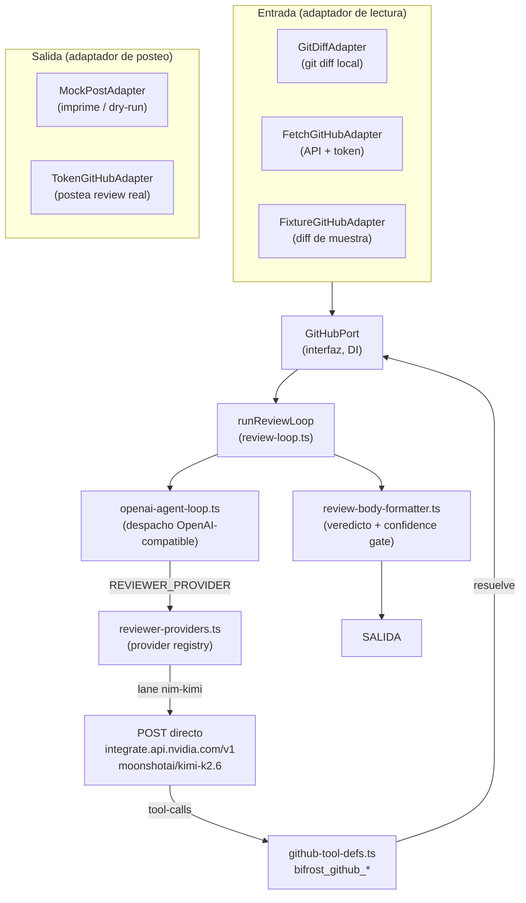

# Arquitectura interna

Heimdall separa **qué razona** (el motor agéntico) de **con quién habla**
(el proveedor de LLM) y de **de dónde lee / a dónde postea** (los puertos de
GitHub). Esa separación es lo que permite que el mismo motor sirva a la CLI
local, a GitHub Actions y a un webhook futuro sin reescribir el loop.

## Data-flow

## El motor: `runReviewLoop`

El corazón es **`runReviewLoop`** (`src/lib/review-loop.ts`): un loop agéntico
tipo **ReAct** (razonar → actuar → observar) que itera hasta un máximo de `N`
vueltas. En cada iteración el modelo puede pedir **tool-calls** (formato
OpenAI-compatible); el loop los ejecuta, devuelve los resultados al modelo y
sigue hasta que el reviewer emite su review o se agotan las iteraciones. El
despacho concreto al API del proveedor lo hace **`openai-agent-loop.ts`**.

## Provider registry

El proveedor de LLM se selecciona por la env var **`REVIEWER_PROVIDER`** contra
el registry de **`reviewer-providers.ts`**. El lane por defecto, **`nim-kimi`**,
apunta a **`moonshotai/kimi-k2.6`** servido en
`https://integrate.api.nvidia.com/v1`, autenticado con el bearer
**`NVIDIA_API_KEY`**. El registry soporta una **cadena de fallback** entre lanes.

!!! note "Bypass del gateway"
    El reviewer hace un **POST directo** al API del proveedor; **no** pasa por
    ningún gateway conversacional. Es un flujo headless de backend que no usa la
    maquinaria del gateway (persona routing, rate-limit por usuario, memoria de
    sesión), así que enrutarlo por ahí sólo heredaría fragilidad sin ganancia.

## Puertos y adaptadores (`GitHubPort` + DI)

Toda interacción con GitHub pasa por la interfaz **`GitHubPort`**
(`src/lib/github-port.ts`), inyectada por dependencia. Los adaptadores son
intercambiables según el modo:

| Adaptador | Rol | Usado en |
| --- | --- | --- |
| `FetchGitHubAdapter` | Lee el PR vía API + token | `pr` (lectura) |
| `TokenGitHubAdapter` | Postea el review real | `pr --post`, CI |
| `MockPostAdapter` | Intercepta el post y lo imprime | dry-run / CLI |
| `FixtureGitHubAdapter` | Diff de muestra (sin red a GitHub) | demos / tests |
| `GitDiffAdapter` | Lee el `git diff` local | `diff` |

El patrón clave: el **modo de lectura** y el **modo de posteo** se componen por
separado. Por ejemplo, `heimdall-review diff` envuelve un `GitDiffAdapter`
(lectura local) en un `MockPostAdapter` (imprime, no postea).

## Tools del reviewer

El reviewer expone un set de tools al LLM, definidas en
**`github-tool-defs.ts`** bajo el prefijo **`bifrost_github_*`**:

- `bifrost_github_pr_read` — lee el PR y su diff.
- `bifrost_github_review_post` — emite el review.
- `bifrost_github_file_read` — lee un archivo del repo.
- `bifrost_github_code_search` — busca en el código.
- `bifrost_github_repo_tree` — recorre el árbol del repo.
- `bifrost_github_review_reply` — responde en un hilo de review.

El LLM las invoca; el executor del loop las resuelve contra el `GitHubPort`
inyectado.

## Render y veredicto

El review final lo arma **`review-body-formatter.ts`** con un **veredicto
determinístico** por severidad:

- Un hallazgo **P1 `security_block`** fuerza **REQUEST_CHANGES**.
- Un **APPROVE de baja confianza** se degrada a **COMMENT**.
- Los **nits** son opt-in.
- Hay un **confidence gate** que filtra hallazgos por debajo del umbral.

Los seams **`CostSink`** y **`PiiRedactor`** existen como no-op, reservados para
extensión futura (contabilidad de costo, redacción de PII) sin tocar el loop.

## Resolución de la NIM key

La CLI resuelve `NVIDIA_API_KEY` con una precedencia explícita: **variable de
entorno** → archivo **`.{env}.nvidia.env`** local y gitignoreado → **error**. El
detalle (incluido el guardrail de `git check-ignore`) está en
**[Uso → Resolución de la NIM key](../usage/index.md#resolucion-de-la-nim-key)**.
