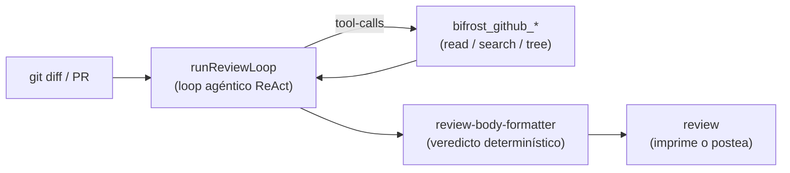

# Heimdall

**Heimdall** es un reviewer de Pull Requests con IA: lee el diff de un PR (o
de tu rama local), corre un loop agéntico que razona sobre los cambios usando
herramientas (leer archivos, buscar en el repo, recorrer el árbol) y emite un
review con veredicto. Es **multi-proveedor**: el lane por defecto habla con
**NVIDIA NIM** sirviendo **Kimi K2** (`moonshotai/kimi-k2.6`).

Licencia: **MIT**.

## Imagen mental rápida

Pensalo como un puente (el *Bifröst*) entre tu código y un modelo de razonamiento,
con un guardián que decide qué pasa:

Tres ideas que lo definen:

- **Un solo motor, varios destinos.** El mismo `runReviewLoop` corre detrás de la
  CLI local, del workflow de GitHub Actions y (a futuro) de un webhook server. Lo
  que cambia es de dónde se lee el PR y a dónde se postea el review — eso vive en
  adaptadores intercambiables, no en el loop.
- **Offline salvo la inferencia.** En modo local el pipeline (leer el diff →
  armar el prompt → renderizar) es 100% local. La única salida de red es la
  llamada al modelo en NVIDIA NIM.
- **Veredicto determinístico.** El LLM razona y propone hallazgos; el veredicto
  final (APPROVE / COMMENT / REQUEST_CHANGES) lo decide código determinístico por
  severidad y confianza, no el modelo.

## Por dónde seguir

- **[Arquitectura](architecture/index.md)** — cómo está armado por dentro: el
  motor, el registry de proveedores, los puertos y adaptadores, las tools y el
  render.
- **[Topología](topology/index.md)** — los tres modos de despliegue: CLI local,
  GitHub Actions ($0) y webhook server (roadmap).
- **[Uso](usage/index.md)** — las formas de invocarlo y cómo se resuelve la NIM
  key.
- **[Decisiones](decisions/index.md)** — el porqué de las elecciones de diseño.
