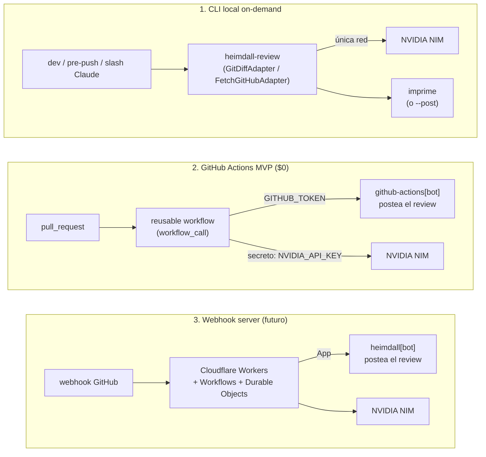

# Topología de despliegue

El mismo motor (`runReviewLoop`) se despliega de tres formas. Lo único que cambia
entre ellas es **de dónde se lee el PR** y **a dónde se postea el review** — es
decir, qué adaptadores de `GitHubPort` se componen. El razonamiento es idéntico.

## 1. CLI local on-demand

Corrés el reviewer a mano desde tu máquina:

- `heimdall-review diff` — revisa el **git diff de tu rama** (vía `GitDiffAdapter`),
  lo imprime, **sin tocar GitHub**.
- `heimdall-review pr <n> [--post]` — revisa un PR; imprime por defecto, o con
  `--post` postea el review real.

Instalación con `bun link` → queda en el **PATH** y corre **offline excepto la
llamada a NVIDIA NIM**. También se puede invocar sin instalar con
`bunx github:chimeranext/heimdall`. El pipeline (git diff → prompt →
render) es **100% local**; la **única red es la inferencia a NIM**.

!!! tip "Cuándo usarlo"
    Iteración rápida antes de abrir el PR, hook de pre-push, o el slash de Claude
    Code. Cero infraestructura.

## 2. GitHub Actions MVP ($0)

Un **reusable workflow** (`workflow_call`) que cada repo invoca desde su propio
workflow de `pull_request`. Usa el **`GITHUB_TOKEN`** del ambiente (con
`permissions: pull-requests: write`) y postea el review como
**`github-actions[bot]`**.

- **Sin server, sin GitHub App.**
- **Único secreto requerido: `NVIDIA_API_KEY`.**
- Costo de infraestructura: **$0** (corre en los runners de Actions).

!!! tip "Cuándo usarlo"
    El default recomendado para automatizar el review en cada PR de un repo, sin
    montar ni operar nada.

## 3. Webhook server (futuro)

El modo durable, documentado como **roadmap**. Un servidor que recibe webhooks de
GitHub y corre el loop de review como pipeline durable:

- **Cloudflare Workers** (entrada del webhook) + **Workflows** (el loop de review
  como pipeline durable, resistente a reintentos) + **Durable Objects**
  (dedup/lock por-PR y rate-limit gate).
- Alternativa de hosting: **Dokploy** o **Cloud Run**.
- Postea como **GitHub App `heimdall[bot]`** (identidad propia, no el bot
  genérico de Actions).

!!! note "Estado"
    Roadmap. Los dos primeros modos cubren el caso on-demand y el automatizado a
    $0; el webhook server agrega durabilidad, dedup e identidad de App cuando el
    volumen lo justifique.
