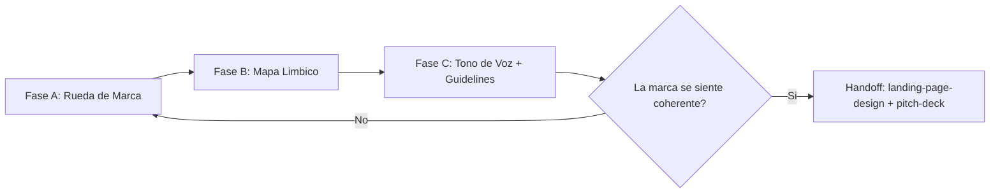
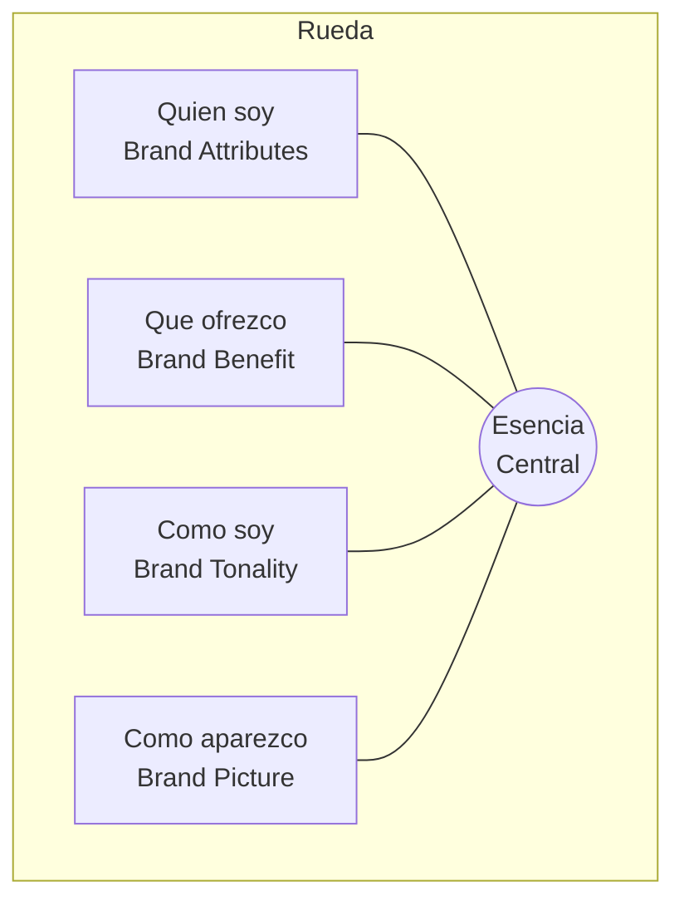
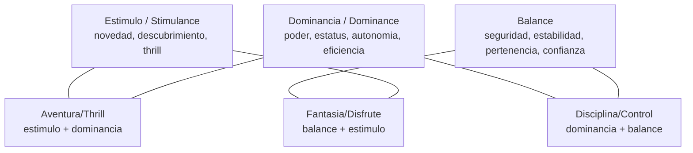

# Identidad de Marca (Brand Identity)

Dialogo guiado interactivo para definir la **identidad estrategica de una marca** antes de
tocar cualquier logo o color. Cubre tres artefactos que se construyen en orden: la Rueda de
Marca (Brand Steering Wheel), el Mapa Limbico (Limbic Map) de posicionamiento emocional, y
la traduccion a tono de voz (Tone of Voice) + guidelines minimos.

Es la version profunda de la **Fase 12 (Marca e Identidad)** del skill `execution-plan`.
Alli se hace una pasada rapida (10 palabras, nombre, elementos de diseno); aqui se construye
el sistema de identidad completo que despues alimenta el landing
(`aaarrr-flywheel-toolkit:landing-page-design`) y el pitch deck (`pitch-deck` Fase 18).

**Prerrequisito**: idealmente el Espacio 1 (validacion de problema) y el Espacio 2 (solucion)
estan completos. Los archivos en `./business/01-problema-hipotesis/perfil-expectativas-cliente.md`
y `./business/02-solucion-validacion/` dan el contexto de cliente y propuesta de valor que la
marca debe encarnar. Si no existen, trabajar con lo disponible y senalar los vacios.

## Regla de idioma

Todo el contenido generado debe estar en **espanol**. Los terminos de branding se presentan
en formato **"espanol (English)"** la primera vez que aparecen. Nombres propios de frameworks
y autores (Esch, Haeusel, Limbic) se mantienen en su idioma original.

## Directorio de salida

```
./business/03-ejecucion-aceleracion/brand-identity/
├── 01-rueda-de-marca.md            # Brand Steering Wheel: 4 cuadrantes + esencia
├── 02-mapa-limbico.md              # Limbic Map: posicionamiento emocional + palabras target
├── 03-tono-de-voz.md               # Tone of Voice derivado de los dos anteriores
└── 04-brand-guidelines-min.md      # Guidelines minimos accionables
```

Este skill produce la **estrategia** de identidad (que siente y como suena la marca), no los
assets visuales finales. El sistema visual concreto (tipografia, escala, color, motion, bento)
vive en `aaarrr-flywheel-toolkit/references/visual-language.md`. Este skill define QUE debe
comunicar ese sistema; ese reference define COMO se implementa en codigo.

## Regla de personalizacion

**Siempre Opcion B** -- reemplazar TODOS los marcadores genericos con contexto del proyecto.
Los ejemplos de abajo usan una marca ficticia (**Acme**) solo para ilustrar la forma; nunca
copiarlos al output del usuario.

## Estilo de preguntas

Una pregunta a la vez. Opcion multiple cuando sea posible. Esperar respuesta antes de avanzar.

## Modos de ejecucion

### Modo normal (por defecto)
Escribe los entregables en `./business/03-ejecucion-aceleracion/brand-identity/`.

### Modo simulacion (what-if)
Se activa con "simulacion", "what-if", "no guardes nada", o `--what-if`. No crea directorios ni
escribe archivos; recorre las fases interactivamente y presenta cada entregable como bloque de
codigo prefijado con `[SIMULACION] Se escribiria: ...`. Al final ofrece escribir todo de una vez.

## Puerta obligatoria

NO generar ningun entregable hasta que las preguntas de la fase correspondiente hayan sido
respondidas y aprobadas. Preguntar UNA A LA VEZ. Esperar respuesta.

---

## Vista general de las 3 fases



La Rueda define **quien es** la marca; el Mapa Limbico define **que emocion** ocupa en la mente
del cliente; el Tono traduce ambos en **como habla**. Se construyen en ese orden porque cada uno
alimenta al siguiente.

---

## Fase A: Rueda de Marca (Brand Steering Wheel)

Modelo de Esch (Markensteuerrad): cuatro cuadrantes alrededor de una **esencia central (Brand
Essence)**. La esencia es el nucleo emocional-racional de una frase; los cuatro cuadrantes la
hacen operable.



### Cuadrante 1 -- Quien soy (Brand Attributes / atributos)

Los hechos duros y competencias tangibles: que es el producto, categoria, herencia, pruebas de
competencia. Responde "sobre que atributos se apoya la marca?".

**RM-A1**: "Nombra 3-5 atributos objetivos y verificables de tu producto/empresa (categoria,
tecnologia, anos, certificaciones, hecho diferencial demostrable)."

*Ejemplo Acme (solo forma): plataforma de analitica self-serve; deploy en < 5 min; SOC2; equipo
ex-infra de dos scale-ups.*

### Cuadrante 2 -- Que ofrezco (Brand Benefit / beneficio)

El beneficio funcional Y emocional que recibe el cliente. Distinguir los dos niveles: beneficio
funcional (que hace por el) vs beneficio emocional (que le hace sentir).

**RM-A2**: "Cual es el beneficio funcional principal (el trabajo que resuelve) y cual el
beneficio emocional (como se siente el cliente al usarlo o al ser visto usandolo)?"

*Ejemplo Acme: funcional = "ve tus metricas sin esperar a data engineering"; emocional = "te
sentis en control, no a ciegas".*

### Cuadrante 3 -- Como soy (Brand Tonality / tonalidad)

La personalidad de la marca como si fuera una persona: rasgos de caracter, temperamento, actitud.
Aqui se decide el archetipo y el temperamento.

**RM-A3**: "Si tu marca fuera una persona, que 3-4 rasgos de personalidad tendria? (ej. directa,
calida, rebelde, meticulosa, ludica, sobria). Elegi rasgos que un competidor NO podria reclamar
igual."

*Ejemplo Acme: directa, sin humo, con humor seco, aliada del practicante.*

### Cuadrante 4 -- Como aparezco (Brand Picture / imagen)

Como se manifiesta sensorialmente: estilo visual, situaciones de uso, simbolos, mundo estetico.
No es el diseno final -- es la direccion (mood) que el sistema visual debera encarnar.

**RM-A4**: "Describi el mundo visual/sensorial de la marca en 3-4 imagenes o situaciones. Que se
ve, en que contexto aparece el cliente, que estetica NO le pega."

*Ejemplo Acme: dashboards limpios en dark mode, developer en su terminal a las 11pm, cero stock
photos de handshakes corporativos.*

### Esencia central (Brand Essence)

Sintetizar todo en **una frase de 2-5 palabras** que capture el corazon de la marca. No es un
tagline de marketing -- es la verdad interna que guia toda decision.

**RM-A5**: "Dada la rueda, cual es la esencia en 2-5 palabras? (formato: [cualidad] + [territorio]).
Vamos a validarla: cada cuadrante debe poder derivarse de esta esencia."

*Ejemplo Acme: "Claridad para builders".*

Generar `01-rueda-de-marca.md` con los 4 cuadrantes + esencia + una nota de coherencia
(como cada cuadrante se deriva de la esencia). Presentar. Esperar aprobacion.

---

## Fase B: Mapa Limbico (Limbic Map)

Modelo de Haeusel: el espacio emocional del consumidor se organiza en **tres grandes
instrucciones (big three)** que forman los ejes del mapa. Toda decision de compra activa alguna
combinacion de estas.



- **Balance**: minimizar riesgo. Emociones target: seguridad, confianza, calma, pertenencia,
  cuidado, tradicion.
- **Dominancia (Dominance)**: prevalecer, avanzar. Emociones target: poder, estatus, orgullo,
  autonomia, eficiencia, victoria.
- **Estimulo (Stimulance)**: buscar lo nuevo. Emociones target: curiosidad, descubrimiento,
  diversion, creatividad, sorpresa.
- Las **zonas mixtas** (Aventura, Disciplina, Fantasia) combinan dos ejes y suelen ser donde una
  marca encuentra un territorio ownable.

### Como posicionar

**MB-1**: "De los tres ejes (Balance / Dominancia / Estimulo), cual es el DOMINANTE para tu
cliente en el momento de decision? Cual es el secundario? (esto define tu zona en el mapa)."

**MB-2**: "Elegi 5-7 palabras-emocion target -- las emociones que queres que el cliente sienta y
asocie con la marca. Deben caer en tu zona dominante+secundaria, no dispersas por todo el mapa."

*Ejemplo Acme (zona Disciplina/Control = dominancia + balance): control, claridad, confianza,
eficiencia, foco, tranquilidad. NO persigue thrill ni fantasia -- una analitica que promete
"aventura" pierde credibilidad.*

**MB-3**: "Que emociones son ANTI-target -- las que tu marca NO debe evocar? (definir el
territorio por exclusion es tan util como por inclusion)."

### Regla de consistencia con la Rueda

La zona limbica debe ser coherente con la tonalidad (Cuadrante 3) y la esencia. Si la esencia es
"claridad para builders" pero las palabras-emocion caen en la zona Fantasia/Disfrute, hay un
conflicto -- resolverlo antes de avanzar.

Generar `02-mapa-limbico.md` con: eje dominante+secundario, las palabras-emocion target (con su
zona), las anti-target, y una nota de coherencia con la Rueda. Presentar. Esperar aprobacion.

---

## Fase C: Tono de Voz (Tone of Voice) + Guidelines minimos

Traducir la estrategia (Rueda + Mapa) en reglas de lenguaje accionables.

### Tono de voz

**TV-1**: "Definamos 3-4 dimensiones de tono como espectros (elegi el punto en cada uno):
  - Formal <----> Casual
  - Serio <----> Con humor
  - Respetuoso <----> Irreverente
  - Entusiasta <----> Sobrio
  Cada eleccion debe derivarse de la tonalidad (Cuadrante 3) y las palabras-emocion (Fase B)."

**TV-2**: "Dame 3 pares 'decimos esto / no decimos aquello' -- ejemplos concretos de frases on-brand
vs off-brand, para que cualquiera que escriba copy sepa la linea."

*Ejemplo Acme:*
| Decimos | No decimos |
|---|---|
| "Deploya en 5 minutos." | "Revoluciona tu stack de datos con IA de proxima generacion." |
| "Se rompio. Aca esta el fix." | "Estamos experimentando dificultades tecnicas." |

### Guidelines minimos

Un one-pager accionable, no un brandbook de 80 paginas. Incluye:
- **Esencia + tagline candidato** (derivado, no inventado aparte).
- **Do / Don't de voz** (de TV-2, ampliado a 5-6 pares).
- **Palabras que usamos / evitamos** (lexico on-brand del mapa limbico).
- **Direccion visual (mood)** del Cuadrante 4 -- con handoff explicito a
  `aaarrr-flywheel-toolkit/references/visual-language.md` para la implementacion en codigo
  (tipografia, color, motion, bento). Este skill NO define hex codes ni fuentes; los describe
  como intencion y delega la especificacion tecnica.

Generar `03-tono-de-voz.md` y `04-brand-guidelines-min.md`. Presentar. Esperar aprobacion.

---

## Handoff -- como esta identidad alimenta el resto

- **`aaarrr-flywheel-toolkit:landing-page-design`** -- la tonalidad + palabras-emocion + do/don't
  de voz son el input de copy del landing; la direccion visual (Cuadrante 4) mapea a las decisiones
  concretas de `visual-language.md`. El landing es la primera prueba publica de si la identidad se
  siente coherente.
- **`pitch-deck` (Fase 18)** -- la esencia y la tonalidad definen la narrativa y el tono del deck;
  el slide de "vision"/"why now" encarna la esencia.
- **`execution-plan` (Fase 12)** -- si el usuario ya corrio la pasada rapida de Fase 12, leer
  `./business/03-ejecucion-aceleracion/04-marca-e-identidad.md` y profundizarla en lugar de
  re-preguntar desde cero. Este skill es el "director's cut" de esa fase.

---

## Principios clave

- **Una pregunta a la vez** -- nunca abrumar.
- **Estrategia antes que estetica** -- ningun color/logo hasta que Rueda + Mapa esten definidos.
- **Coherencia forzada** -- cada fase valida contra la anterior; los conflictos se resuelven, no
  se ignoran.
- **Ownable, no generico** -- rechazar rasgos y emociones que cualquier competidor reclamaria igual.
- **Delegar lo visual** -- este skill define intencion; `visual-language.md` define implementacion.
- **Espanol** con terminos de branding en formato "espanol (English)" la primera vez.
- **Diagramas en Mermaid**, no ASCII art.

## Fuentes metodologicas

- **Brand Steering Wheel (Markensteuerrad)** -- Franz-Rudolf Esch, modelo academico de gestion de
  marca (4 cuadrantes + esencia). Reconstruido como forma; ejemplos originales (Acme).
- **Limbic Map** -- Hans-Georg Haeusel / Gruppe Nymphenburg, modelo de posicionamiento emocional
  sobre los ejes Balance / Dominance / Stimulance. Reconstruido como forma; palabras-emocion de
  ejemplo son originales, no tomadas de plantillas de terceros.
