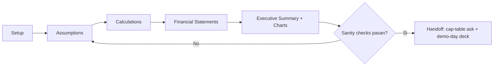

# Financial Model

Construye un **modelo de proyección financiera a 5 años** para UN venture — el modelo cuantitativo que traduce supuestos de negocio (drivers de revenue, costos, hiring, churn) en P&L, cash flow y runway. Es el complemento cuantitativo del skill estratégico `business-model-toolkit:execution-plan` (Fase 11 Modelo Financiero): allí se decide el *marco* (Target / Forecast / Resource Allocation, Beyond Budgeting); aquí se genera el *modelo con números* que alimenta el ask del `cap-table-builder` y el deck de `demo-day-prep`.

## ⚠️ DISCLAIMER

Un modelo financiero de early-stage es un **instrumento de planeación bajo incertidumbre**, no un estado financiero auditado. Los outputs de esta skill son proyecciones basadas en los supuestos que el usuario provee — la calidad del modelo nunca supera la calidad de esos supuestos ("garbage in, garbage out").

**Esta skill genera un modelo de preparación, NO reemplaza**:

- **Contador / CPA** — para estados financieros reales (GAAP/IFRS), cierres, y compliance fiscal
- **CFO / analista financiero** — para el modelo de board-grade que resiste diligence de Serie A
- **Auditor** — ninguna cifra proyectada es un hecho auditado
- **Asesor fiscal** — impuestos, depreciación fiscal, créditos y jurisdicción se modelan de forma simplificada aquí

Regla de honestidad del modelo: **un forecast agresivo que no se cumple destruye confianza con inversores más rápido que un forecast conservador**. Esta skill empuja hacia supuestos defendibles y marca los que huelen a hockey-stick.

## Regla de idioma

Español para interacción y narrativa. **Términos financieros en inglés** (P&L, MRR, ARR, COGS, CAC, LTV, runway, burn, gross margin, EBITDA, Rule of 40, etc.) — convención de industria. Los headers de las tablas del modelo se generan en inglés para compatibilidad con export a Sheets/Excel.

## Directorio de salida

```
./launchpad/{startup-slug}/financial-model/
├── 00-setup.md                       # Moneda, fiscal year, business model, horizonte
├── 01-assumptions.md                 # Todos los drivers y supuestos, uno por uno
├── 02-pnl-monthly.md                 # P&L mensual años 1-2 (24 meses)
├── 03-pnl-annual.md                  # P&L anual años 1-5 (rollup + años 3-5)
├── 04-cash-flow.md                   # Cash flow + runway + burn
├── 05-financial-statements.md        # P&L, cash flow, balance simplificado
├── 06-executive-summary.md           # Resumen + chart specs + sanity checks
└── exports/
    ├── pnl-monthly.csv               # Tablas machine-readable para Sheets/Excel
    ├── pnl-annual.csv
    └── cash-flow.csv
```

Los `.csv` se generan como bloques markdown listos para copiar a una hoja de cálculo. Esta skill **no ejecuta fórmulas en vivo** — produce las tablas ya calculadas y documenta la fórmula de cada celda derivada para que el founder pueda reconstruirlas en Sheets/Excel y hacer sensitivity analysis.

---

## Flujo del modelo — 5 etapas con puertas de aprobación



Regla: **una etapa a la vez**. No avanzar a Calculations hasta que TODOS los assumptions estén confirmados por el usuario. Preguntar de a un driver por vez.

---

## Etapa 1 — Setup

Antes de cualquier número, fijar el marco. 4 preguntas:

**S-1 — Moneda y unidad**: "¿En qué moneda modelas (USD, EUR, MXN, CRC…)? ¿Cifras en unidades, miles o millones?" (default: USD, unidades).

**S-2 — Fiscal year**: "¿Cuándo arranca tu fiscal year? ¿Mes 1 del modelo = qué mes calendario?" (default: calendar year, mes 1 = enero).

**S-3 — Business model**: elegir el preset que mejor encaje (define la estructura de revenue y los benchmarks de sanity check):

| Preset | Revenue driver primario | COGS típico | Gross margin sano |
|---|---|---|---|
| **SaaS / Subscription** | MRR = new + expansion − contraction − churn | Hosting + support + payment fees | 70-85% |
| **DTC / E-commerce** | Orders × AOV | COGS producto + shipping + fulfillment | 35-55% |
| **Marketplace** | GMV × take-rate | Payment processing + trust&safety | 60-80% (sobre net revenue) |
| **Services / Agency** | Billable hours × rate (o retainers) | Delivery labor (fully-loaded) | 40-60% |
| **Transactional / Fintech** | TPV × spread/fee | Interchange + risk + compliance | 50-75% |

**S-4 — Horizonte y granularidad**: 5 años. **Mensual** para años 1-2 (24 meses, donde vive la incertidumbre y el runway), **anual** para años 3-5. Confirmar.

Generar `00-setup.md`. Presentar. Esperar aprobación.

---

## Etapa 2 — Assumptions

El corazón del modelo. Se agrupa en cuatro bloques. Preguntar driver por driver; para cada uno, ofrecer un default razonable del preset elegido y pedir override.

### 2a. Revenue drivers (según preset)

Para **SaaS** (ejemplo del preset — reconstruir con el negocio real del usuario):

- **New customers/month** — arranque + growth rate MoM. Preguntar: "¿Cuántos clientes nuevos el mes 1 y a qué % crece mes a mes?" Modelar el growth rate como **decaying** (no constante): un 20% MoM sostenido 60 meses es hockey-stick — marcarlo.
- **ARPA** (average revenue per account) — precio efectivo por cuenta/mes.
- **Gross churn mensual** (logo churn) — % de cuentas que cancelan cada mes.
- **Net revenue retention** — expansion (upsell/seats) menos contraction. NRR > 100% = revenue crece aún sin nuevos logos.
- **MRR recursion**: `MRR[t] = MRR[t-1] × (1 − gross_churn) + expansion − contraction + new_customers[t] × ARPA`. `ARR = MRR × 12`.

Para **DTC**: orders/month (con seasonality opcional), AOV, repeat-purchase rate, blended return rate.
Para **Marketplace**: GMV, take-rate, buyer/seller growth, liquidity ratio.
Para **Services**: headcount billable, utilization %, blended rate, retainer mix.

### 2b. Cost structure

- **COGS / variable costs** — atados a revenue vía el gross margin del preset. Preguntar por componentes (hosting, payment fees %, fulfillment/unit, delivery labor).
- **Fixed costs (OpEx)** — desglosar en: **People** (ver hiring plan), **Software/tools**, **Rent/infra**, **Marketing** (o driver de CAC × new customers si acquisition es paga), **G&A** (legal, accounting, insurance).

### 2c. Hiring plan

Driver dominante del burn en early-stage (típicamente 60-80% del OpEx). Modelar como tabla de roles con **mes de contratación** y **fully-loaded cost** (salary × 1.25-1.4 para cargas sociales, benefits, equipo):

| Role | Start month | Base/yr | Fully-loaded/yr | Dept |
|---|---|---|---|---|
| Founder x2 | M1 | (below-market) | — | — |
| Sr Engineer | M4 | — | — | Product |
| … | | | | |

Regla: atar contrataciones a **milestones/gates**, no al calendario (consistente con Resource Allocation de `execution-plan`). Marcar si el plan contrata delante del revenue de forma insostenible.

### 2d. Growth & funding assumptions

- **Growth rate por año** (decaying: p.ej. 15% MoM año 1 → 8% → 5%).
- **Churn assumption** y su mejora esperada con producto más maduro.
- **Starting cash** + **capital raise** planeado (monto, mes, dilución esperada — cross-ref `cap-table-builder`).

Generar `01-assumptions.md` con TODOS los drivers listados y su valor + fuente/justificación. Presentar. Esperar aprobación. **No avanzar con supuestos sin confirmar.**

---

## Etapa 3 — Calculations

Con los assumptions congelados, calcular. Producir dos vistas.

### 3a. P&L mensual años 1-2 (`02-pnl-monthly.md` + `exports/pnl-monthly.csv`)

24 columnas (M1…M24), filas:

```
Revenue (por stream)
  = New MRR + Expansion − Contraction − Churned MRR   [para SaaS]
COGS
Gross Profit          = Revenue − COGS
Gross Margin %        = Gross Profit / Revenue
OpEx
  People
  Marketing
  Software/Tools
  G&A
Total OpEx
EBITDA                = Gross Profit − Total OpEx
Net Burn / Profit     = EBITDA (proxy early-stage; sin D&A/tax material)
```

Documentar la fórmula de cada fila derivada. Cada `.csv` va como tabla markdown con headers en inglés.

### 3b. P&L anual años 1-5 (`03-pnl-annual.md` + `exports/pnl-annual.csv`)

Rollup de años 1-2 desde el mensual + proyección anual de años 3-5. Añadir métricas SaaS-grade: ARR fin de año, YoY growth %, ARR per FTE, **Rule of 40** (growth% + EBITDA margin%).

---

## Etapa 4 — Cash Flow & Financial Statements

### 4a. Cash flow + runway (`04-cash-flow.md` + `exports/cash-flow.csv`)

```
Beginning cash
+ Cash from operations (≈ EBITDA ± working capital)
+ Financing (raises)
− CapEx
= Ending cash
Net monthly burn      = promedio de meses con burn negativo
Runway (months)       = Ending cash / avg monthly net burn
Cash-out date         = mes donde ending cash < 0 (si aplica)
```

Marcar con claridad el **mes de cash-out** si el modelo llega a cero, y cuánto raise se necesita para llegar a un milestone defendible (default: 18-24 meses de runway post-raise).

### 4b. Financial statements simplificados (`05-financial-statements.md`)

Los 3 estados en forma resumida y honesta sobre sus límites:
- **Income Statement (P&L)** — anual, 5 años.
- **Cash Flow Statement** — operating / investing / financing.
- **Balance Sheet simplificado** — cash, deferred revenue (SaaS anual prepaga), equity raised, accumulated deficit. Declarar que es indicativo, no contable.

---

## Etapa 5 — Executive Summary + Charts + Sanity Checks

### 5a. Executive summary (`06-executive-summary.md`)

Media página, orientada a inversor: ARR year 5, path to breakeven (mes), peak burn, total capital needed, y los 3 supuestos que más mueven el resultado.

### 5b. Chart specs (describir como generables, no imágenes)

Especificar cada chart como una tabla de datos + tipo, lista para renderizar en Sheets/Excel/una lib de charting:

| Chart | Tipo | Series (X, Y) |
|---|---|---|
| Revenue ramp | Line/area | Month, MRR/ARR |
| Burn & runway | Bar + line | Month, net burn / ending cash |
| Gross margin trend | Line | Month, GM% |
| Cost breakdown | Stacked area | Month, COGS/People/Marketing/G&A |
| Path to breakeven | Line | Month, EBITDA (cruce con 0) |

### 5c. Sanity checks (obligatorio antes del handoff)

Correr el modelo contra benchmarks y **marcar cada red flag**:

| Check | Regla sana | Red flag |
|---|---|---|
| **Gross margin** vs preset | Dentro del rango del business model (tabla S-3) | GM fuera de rango → COGS mal modelado |
| **Burn multiple** | Net burn / net new ARR < 1.5 (bueno), 1.5-2 (ok) | > 2 → ineficiente; quema mucho por cada $ de ARR nuevo |
| **Growth rate** | Decaying, defendible | Constante y alto por 60 meses → hockey-stick |
| **Magic number** (SaaS) | > 0.75 sales efficiency | < 0.5 → go-to-market roto |
| **Rule of 40** (año 3+) | growth% + margin% ≥ 40 | < 40 → ni crece ni es eficiente |
| **CAC payback** | < 12 meses (cross-ref aaarrr unit-economics) | > 18 meses → unit economics frágiles |
| **Runway post-raise** | 18-24 meses | < 12 → raise insuficiente para el próximo milestone |
| **Headcount vs revenue** | ARR/FTE creciente | Contratar muy por delante del revenue |

Si algún check falla, volver a Assumptions y ajustar (no maquillar el output).

---

## Conexión con el resto del toolkit

Este modelo es un nodo, no una isla:

- **`cap-table-builder`** — el **cash-out date** y el **runway post-raise** definen el *tamaño y timing del raise*; el raise define la *dilución* que se modela en el cap table. Fluir: financial-model calcula "necesito $X para 18 meses" → cap-table-builder modela la ronda (SAFE/priced) y la dilución resultante.
- **`investor-matching`** — el **check size** implícito (monto del raise) y el **stage** (métricas del año 1-2) alimentan el scoring de fit de inversores.
- **`demo-day-prep`** — el executive summary + los charts son el **slide financiero** del deck (típicamente slide 9-10: "Financials & Ask").
- **`stage-tracker`** — runway y burn son inputs del Chimera Score (axis de traction/capital efficiency).
- **`business-model-toolkit:execution-plan` (Fase 11)** — provee el *marco* Beyond Budgeting (Target/Forecast/Resource Allocation). Este modelo cuantitativo **es** el Forecast honesto de ese framework. Si el usuario ya hizo la Fase 11, leer `./business/03-ejecucion-aceleracion/03-modelo-financiero.md` para reusar sus supuestos en lugar de re-preguntar.
- **`aaarrr-flywheel-toolkit` (revenue / unit-economics)** — CAC, LTV, payback y gross margin del modelo de crecimiento deben ser **consistentes** con los assumptions de acquisition de este modelo. Si divergen, marcarlo.

---

## Modos de ejecución

### Modo normal (por defecto)
Escribe todos los entregables en `./launchpad/{startup-slug}/financial-model/`.

### Modo simulación (what-if / sensitivity)
Se activa con "simulación", "what-if", "no guardes", o `--what-if`. No escribe archivos; recorre las etapas y presenta cada tabla como bloque de código, prefijando `[SIMULACION] Se escribiria: ...`. Útil para correr escenarios (base / bull / bear) cambiando 1-2 drivers y comparando runway y breakeven sin ensuciar el directorio.

---

## Principios clave

- **Una etapa/driver a la vez** — nunca volcar todos los supuestos de golpe.
- **Garbage in, garbage out** — el modelo nunca es mejor que sus supuestos; empujar hacia defendibles.
- **Forecast honesto > forecast bonito** — marcar hockey-sticks, no producirlos.
- **Documentar cada fórmula derivada** — el founder debe poder reconstruir el modelo en Sheets.
- **Sanity checks obligatorios** — no hacer handoff sin correr los benchmarks.
- **Español con términos financieros en inglés**; headers de tabla en inglés para export.
- **Diagramas en Mermaid**, no ASCII art.

## Fuentes metodológicas

- **Beyond Budgeting** (Humble/Molesky/O'Reilly, *Lean Enterprise*, cap. 13) — Target/Forecast/Resource Allocation, vía `business-model-toolkit:execution-plan`.
- **SaaS metrics** — Rule of 40, Magic Number, Burn Multiple, NRR (literatura estándar de SaaS finance).
- Estructura de modelo (Setup → Assumptions → Calculations → Statements → Charts) reconstruida como forma genérica de un financial model; ejemplos originales (Acme), sin plantillas de terceros.
